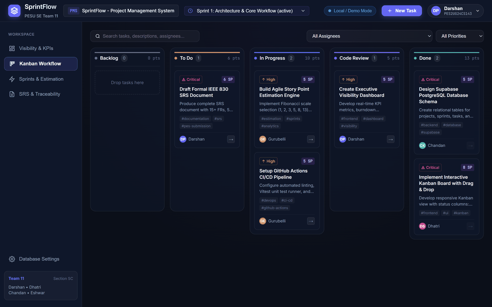
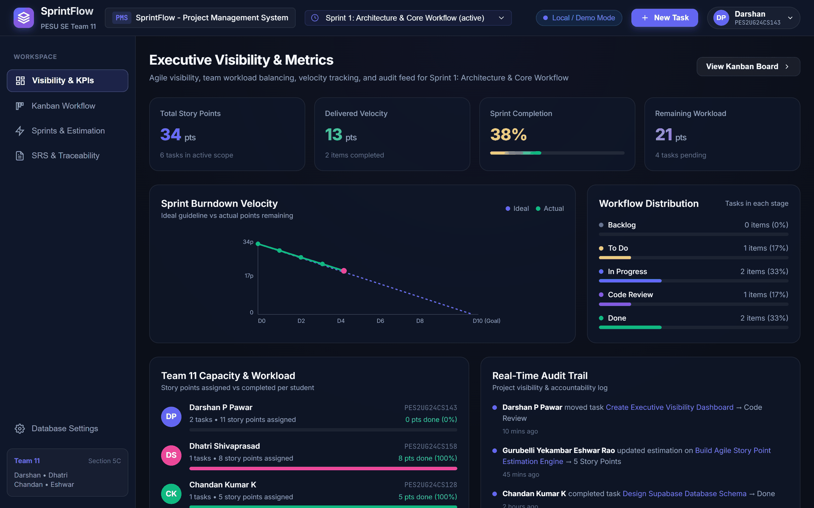
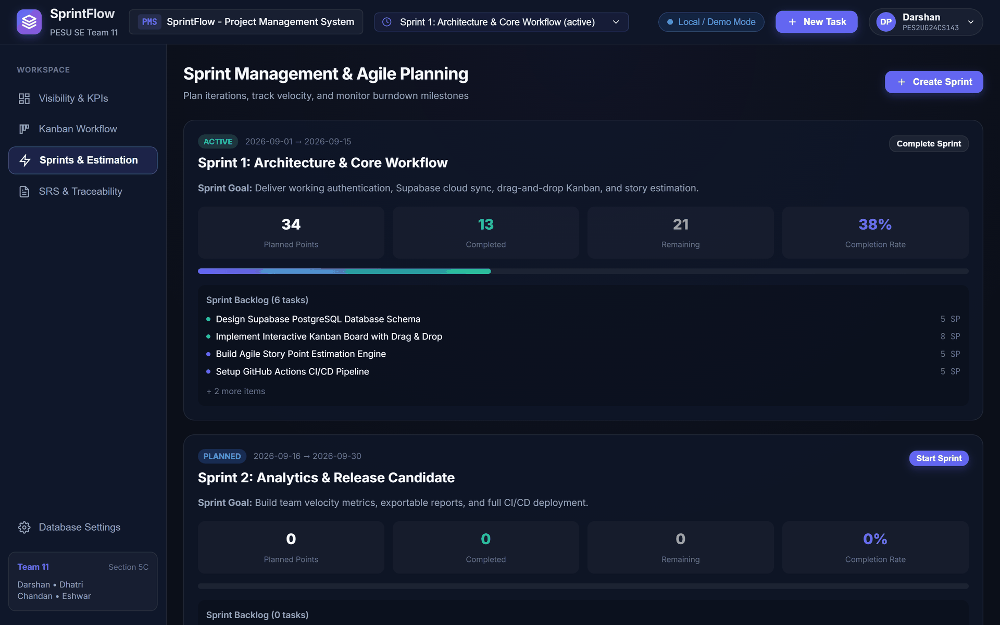
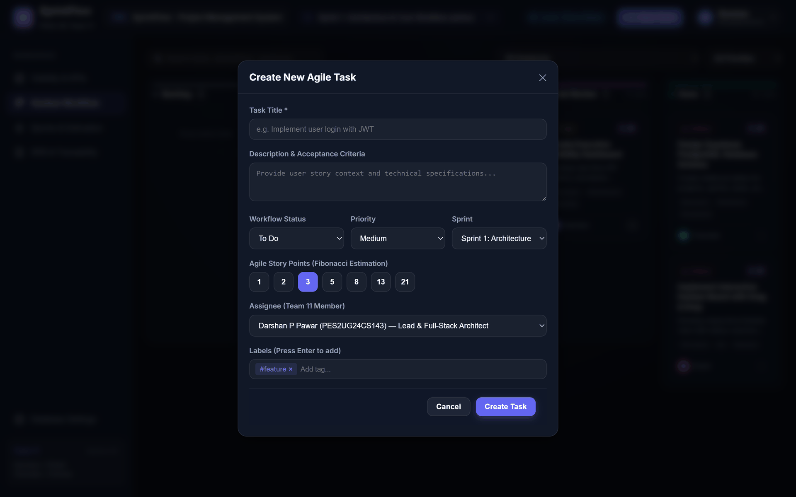
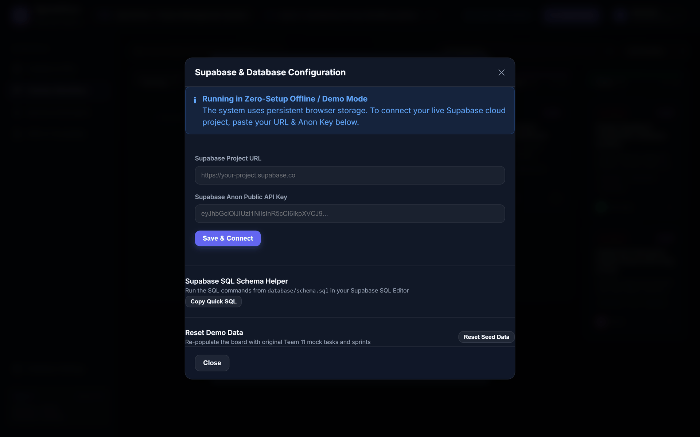

# Application Screenshots

## SprintFlow -- Agile Project Management System

**Team 11 | Section 5C | PES University**
**Related Documents:** `docs/SAD_Document_Team11.md`, `docs/STP_Document_Team11.md`

---

## 1. Purpose

This document provides visual evidence of the implemented system, linking each screen back
to the architecture components specified in the SAD and the test cases specified in the
STP. It allows an evaluator to confirm that the documented design corresponds to working
software.

## 2. Capture Conditions

| Property | Value |
| :--- | :--- |
| Build | Vite 5 production build (`npm run build`), served via `npm run preview` |
| Browser | Chrome, headless |
| Viewport | 1440 x 900 logical pixels, captured at 2x and downscaled to 1920 x 1200 |
| Data mode | Zero-configuration offline mode, no Supabase credentials supplied |
| Data source | Seed dataset from `src/services/mockData.js` |

All screenshots were taken with no database configured, which demonstrates that the
application is fully functional without any setup step. This is the state an evaluator
sees immediately after `npm run dev`.

---

## 3. Kanban Workflow Board

The default view after launch. Five workflow columns are rendered in fixed order with a
task count and a story point subtotal in each header. Cards show a priority badge with a
text label, the story point estimate, labels, and the assignee.

| Property | Detail |
| :--- | :--- |
| Component | `KanbanBoard.jsx` (SAD 3.4) |
| SAD reference | Section 4.2.1, Figure 4.1 -- task creation and state transition |
| Test cases | TC-KAN-01 (five-column render), TC-KAN-02 (drag-and-drop), TC-FILT-01 (filtering) |
| Requirements | PMS-F-003, PMS-F-004, PMS-F-005, PMS-F-011 |

Visible detail: the Backlog column shows its empty state ("Drop tasks here") rather than
rendering blank, which is the behaviour specified in the UX design specification.

---

## 4. Executive Visibility Dashboard

The visibility surface required by the project brief. Four KPI cards report total story
points, delivered velocity, sprint completion percentage and remaining workload. Below
them, the SVG burndown chart plots the ideal guideline against actual points remaining.

| Property | Detail |
| :--- | :--- |
| Component | `DashboardView.jsx` (SAD 3.4) |
| SAD reference | Section 4.2.2, Figure 4.2 -- estimation and burndown generation |
| Test cases | TC-DASH-01 (KPI metrics), TC-BURN-01 (burndown), TC-WORK-01 (workload) |
| Requirements | PMS-F-009, PMS-F-010, PMS-F-012, PMS-F-017 |

The figures are internally consistent, which is what TC-BURN-01 verifies: 34 total story
points, 13 delivered, and the actual burndown line terminating at 21 points remaining,
matching the Remaining Workload card exactly. The chart is computed from sprint state, so
moving a task to Done lowers the actual line.

The Real-Time Audit Trail on the right evidences PMS-F-012: every mutation is recorded
with the acting user, the affected entity and a timestamp.

---

## 5. Sprint Management and Estimation

Sprint lifecycle management: creation with name, goal and date range, and capacity
reporting derived from the Fibonacci story points of the assigned tasks.

| Property | Detail |
| :--- | :--- |
| Component | `SprintManager.jsx` (SAD 3.4) |
| SAD reference | Section 4.1 Design Overview; ADR-005 (Fibonacci estimation) |
| Test cases | TC-SPR-01 (sprint creation), TC-EST-02 (capacity calculation) |
| Requirements | PMS-F-007, PMS-F-008 |

---

## 6. Task Creation and Fibonacci Estimation

The task dialog, used for both creation and editing so that a single validation path
serves both. Title is required; description, assignee and labels are optional.

| Property | Detail |
| :--- | :--- |
| Component | `TaskModal.jsx` (SAD 3.4) |
| SAD reference | Section 4.3.1 Tasks API -- field contracts |
| Test cases | TC-TASK-01 (creation), TC-TASK-02 (priority), TC-TASK-03 (empty title rejected), TC-EST-01 (story points) |
| Requirements | PMS-F-002, PMS-F-006, PMS-F-016 |

Note the story point control: the seven Fibonacci values are presented as fixed choices
rather than a free numeric input. An invalid estimate is therefore unrepresentable in the
interface, rather than being accepted and rejected afterwards. This is the design decision
recorded in ADR-005 and verified by TC-EST-01.

---

## 7. Database Configuration

The dual-mode data layer described in ADR-003. The panel states plainly which mode is
active, so the user always knows where their data is stored.

| Property | Detail |
| :--- | :--- |
| Component | `SettingsModal.jsx`, `supabaseClient.js` (SAD 3.4) |
| SAD reference | Section 3.6 Data Stores; Section 3.9 Security Architecture |
| Test cases | TC-SET-01 (mode switch), TC-SUPA-01 (cloud persistence), TC-OFF-01 (offline persistence) |
| Requirements | PMS-F-013, PMS-F-014, PMS-F-015 |

The banner confirms the system is running in zero-setup offline mode on persistent browser
storage. Supplying a Project URL and anon key switches the `DataService` abstraction to
Supabase PostgreSQL without any change at the call sites, which is the point of the
abstraction. Only the anonymous public key is accepted; authorisation is enforced by Row
Level Security at the database tier, as recorded in ADR-004.

---

## 8. Coverage Summary

| Screen | SAD Components Evidenced | Requirements Evidenced |
| :--- | :--- | :--- |
| Kanban board | KanbanBoard, ProjectContext | PMS-F-003, 004, 005, 011 |
| Dashboard | DashboardView, Estimation Utilities | PMS-F-009, 010, 012, 017 |
| Sprint manager | SprintManager, Estimation Utilities | PMS-F-007, 008 |
| Task modal | TaskModal | PMS-F-002, 006, 016 |
| Database settings | SettingsModal, SupabaseClient | PMS-F-013, 014, 015 |

Sixteen of the eighteen functional requirements are visible in these five screens. The
remaining two -- PMS-F-001 (authentication) and PMS-F-018 (documentation viewer) -- are
demonstrated live rather than captured here. The cloud-connected half of PMS-F-013 also
needs a live Supabase project, so only its offline path is evidenced above.
